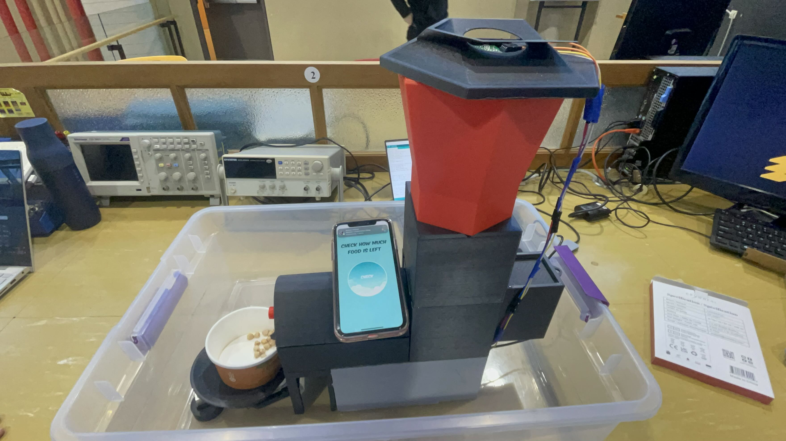
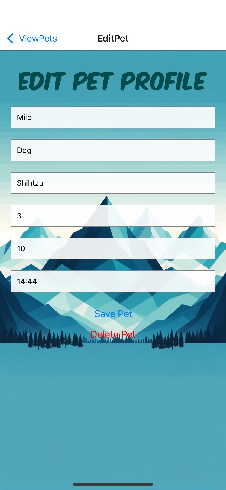
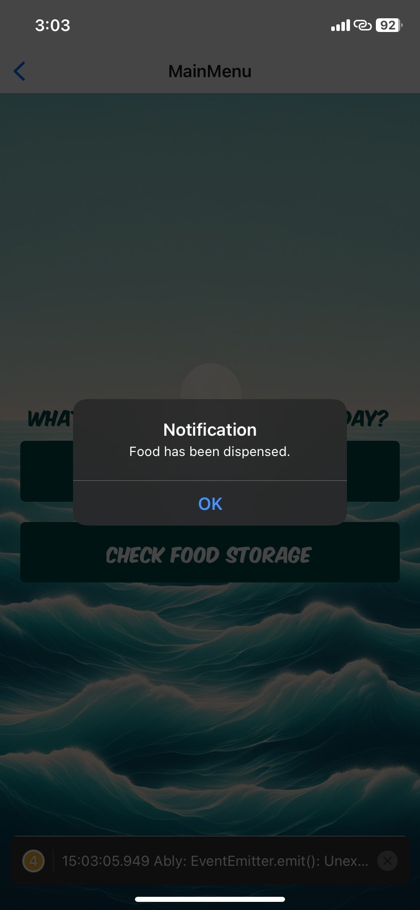
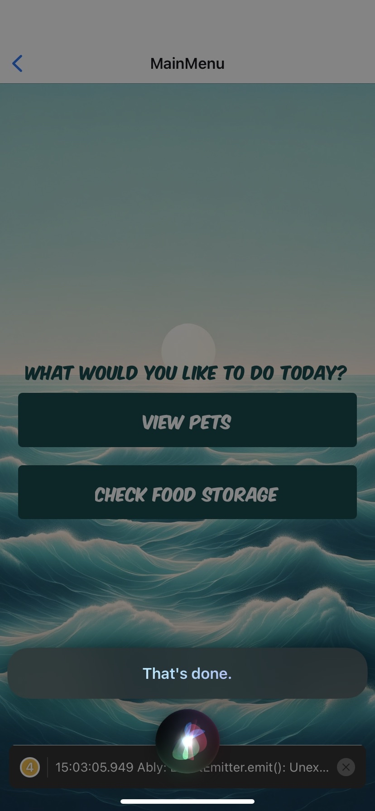

# 🐶 Autonomous Pet Feeder

A smart, voice-activated feeding system built to automate mealtime for pets. Combines hardware and a React Native app for remote control and status monitoring — ensuring your pet is fed even when you’re away.


---

## 🚀 Overview

Designed to simplify pet feeding routines, this system combines hardware automation with cross-platform mobile development.  
It lets users feed pets manually, on a schedule, or using voice commands — even when they’re not home.

---

## 🎥 Demo

> ▶️ [Click to watch the full demo.](demo/dog_feeder_demo.mov)

---

## 📸 Gallery

| Device | App Screens |
|--------|--------------|
|  |    |

| Dispensing | Confirmation |
|------------|--------------|
|   |   |

---

## 🧩 Problem / 💡 Solution

**Problem:** Busy schedules and inconsistent feeding times lead to missed meals and unhealthy habits for pets.  
**Solution:** A connected feeder that works through an app or Siri, allowing remote, scheduled, or voice-triggered food dispensing — anytime, anywhere.

---

## ✨ Features

- 📱 iOS App Interface (React Native)
- 📡 Real-time updates via Firebase
- 🗣️ “Hey Siri, feed my dog” shortcut
- 🧠 Custom pet profiles + food level tracking
- 🔘 Hardware override with push-button

---

## 🧠 How It Works

1. **User Interface**  
   The app allows owners to create pet profiles, check food levels, and trigger feed events with a tap.

2. **Backend Logic**  
   Firebase Realtime Database syncs instantly with the Arduino board to trigger the stepper motor.

3. **Hardware System**  
   Arduino-based controller operates the feeder. The circuit includes a button for manual override.

4. **Voice Activation**  
   Siri Shortcuts send HTTP requests to update Firebase, triggering the feeder remotely via voice.

---

## 💻 Tech Stack

| Area             | Tools / Tech                         |
|------------------|--------------------------------------|
| Hardware         | Raspberry Pi Pico, Ultrasonic Sensor, Servo |
| Firmware         | Arduino C++                          |
| App Development  | React Native, Expo                   |
| Voice Feedback   | Pre-recorded prompts, UI toggles     |
| Communication    | USB Serial / Potential WiFi control (future) |

---

## 📁 Project Structure

```bash
autonomous-pet-feeder/
├── app/               # React Native app (Expo)
├── hardware-code/     # Arduino code for sensor + motor control
├── images/            # Feeder photos and UI screenshots
├── demo/              # Project demo video
├── docs/              # Engineering case study & notes
└── README.md
```

---

## 👥 Team

- **Mousa Pirzada** – iOS app, Firebase integration, system design, Siri command implementation
- **Mustafa Hasan** – Circuitry, Arduino setup, motor driver configuration
- **Raihan Ahmed** – 3D printing, mechanical design, hardware assembly

---

## 🏛️ Course

> MREN 328 – Signals and Systems, Queen’s University, 2024

---

## 📖 Learn More

- [📄 Engineering Case Study](docs/autonomous-pet-feeder-case-study.md)
- [📱 UI Screenshots](/assets/images/welcome_page.png/)
- [🌐 GitHub Repo](https://github.com/20mup/autonomous-pet-feeder)

---

> _Made with circuits, code, and a lot of love for Milo._ 🐾
